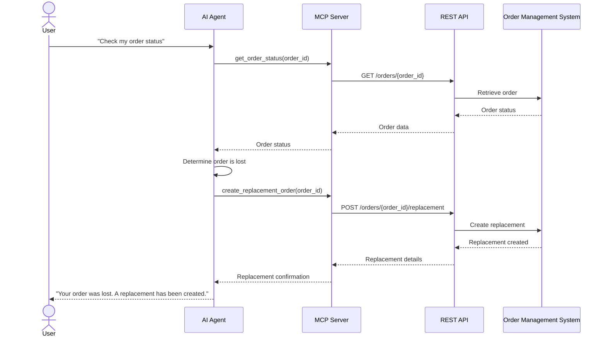

# How REST API, MCP, can improve the AI use case.

## REST API and MCP in AI Use Cases

AI models are powerful at understanding language and making decisions, but by themselves they are limited to the information available in their context and the capabilities provided by the model. REST APIs and MCP extend these capabilities by allowing AI systems to interact with external data, services, and tools.

### Connecting AI to External Systems

REST APIs allow an AI application to communicate with existing software and business systems. For example, an AI customer-support agent can call a REST API to retrieve customer information from a CRM, check an order status, or create a support ticket. This allows the AI to become an interface to existing systems rather than operating as an isolated chatbot.

MCP provides a more AI-oriented approach to the same problem. Instead of requiring the AI application to implement custom integration logic for every external service, an MCP server can expose tools and resources in a standardized way. An AI agent can then interact with these capabilities through an MCP client.

### Accessing Real-Time Data

One limitation of an LLM is that its internal knowledge may not contain the latest information. External APIs can provide the AI with current information such as inventory, transaction status, weather, or customer records.

For example, when a user asks, "Where is my order?", the AI can use a tool to retrieve the latest order status rather than relying on information stored in the model. This makes the response more accurate and relevant to the current state of the system.

### Executing Actions and Workflows

External integrations also allow AI to move beyond generating text and actually perform actions. Through REST APIs, an AI application can create records, update data, submit requests, or trigger business processes.

For example, an AI support agent could identify that a customer's order is damaged, retrieve the order details, create a replacement request, and then inform the customer of the result. The LLM handles the reasoning and interaction, while external systems perform the actual operations.

### Tool Access and Context with MCP

MCP is particularly useful for AI agents that need to work with multiple tools and sources of context. An MCP server can expose capabilities such as database queries, file access, documentation search, or business operations to the agent.

This creates a separation between the AI's reasoning and the implementation of external capabilities. The agent can determine which tool it needs, provide the required parameters, and use the result as additional context for its next step.

Therefore, REST APIs and MCP help transform AI from a system that primarily generates information into one that can retrieve information, interact with external systems, and execute real-world tasks. REST APIs provide the connectivity to existing services, while MCP provides a standardized approach for making tools and context available to AI agents.

## Practical Architecture

The way REST APIs and MCP are integrated depends on the complexity of the AI use case. A simple AI application may directly call REST APIs, while a more capable AI agent can use MCP as an abstraction layer for accessing multiple tools and data sources.

### AI + REST API

In a basic architecture, the AI application acts as the bridge between the LLM and external services. The LLM determines what information or action is required, and the application calls the appropriate REST API.

For example:

**User → LLM → AI Application → REST API → External System**

This approach works well when the application has a small and well-defined set of integrations. The application controls the API calls, authentication, validation, and handling of responses.

### AI Agent + MCP

For an AI agent with multiple tools, MCP can provide a standardized interface between the agent and external capabilities.

**User → AI Agent → MCP Client → MCP Server → Tools / Data**

The agent can discover available tools and decide which one to use based on the user's request. The MCP server handles the implementation details of those tools, allowing the agent to focus on reasoning and task execution.

This architecture is useful when an agent needs to work with many different resources, such as databases, file systems, documentation, or internal business tools.

### MCP + REST API

MCP and REST API can also work together rather than being alternatives. An MCP server can expose a tool to the AI agent while internally using existing REST APIs to communicate with business systems.

**User → AI Agent → MCP → REST API → Business System**

For example, an MCP server could expose a `get_order_status` tool. When the agent invokes it, the MCP server calls the company's existing order-management REST API and returns the result to the agent.

This approach allows organizations to reuse their existing REST infrastructure while providing AI agents with a standardized interface for accessing those capabilities. As a result, REST APIs can remain the underlying integration layer, while MCP acts as an AI-oriented interface on top of them.

## Real-World Use Case

A practical example of combining REST APIs and MCP is an AI customer-support agent. Instead of only answering questions from a predefined knowledge base, the agent can retrieve customer-specific information and perform actions on behalf of the user.

### Example AI Agent Workflow

Suppose a customer asks "My order hasn't arrived yet. Can you check the status and arrange a replacement if it was lost?"

The AI agent first understands the user's intent and determines that it needs access to the order-management system. It can use an MCP tool such as get_order_status to retrieve the latest order information.

The agent first retrieves the order status. If the order is confirmed to be lost, it can invoke another MCP tool, such as `create_replacement_order`. The MCP server can then call the appropriate REST API to create the replacement in the company's existing system.

### Data Retrieval and Tool Execution

This example demonstrates the complementary roles of the LLM, MCP, and REST API. The LLM handles understanding, reasoning, and decision-making, MCP provides a standardized interface for accessing tools, and the REST API performs the actual interaction with the business system.

This architecture allows the AI agent to move beyond simply generating responses. It can retrieve real-time information, make decisions based on that information, and execute actions through existing business infrastructure. The same pattern can be applied to many other use cases, such as customer service, internal enterprise assistants, software development agents, and workflow automation.